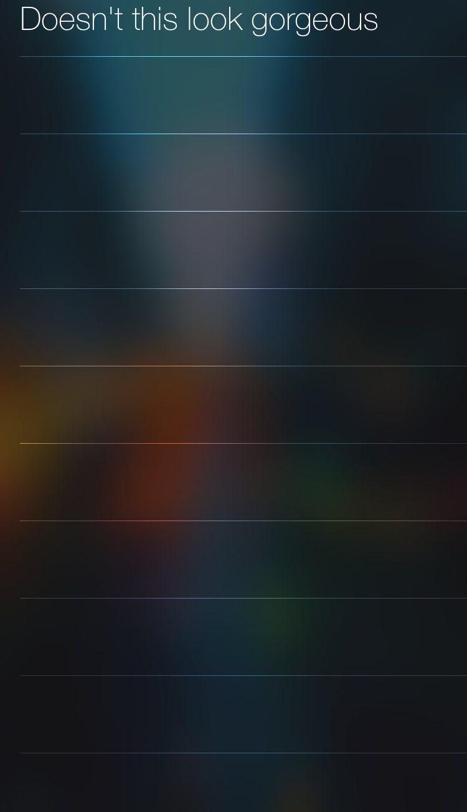

# UITableViewCellSeperatorEffectFun

How to use the UITableView seperator effect with vibrancy to help make your cell separators pop like in iOS Notification Center

To get this working you need a `UIVisualEffectView` to exist in the hierarchy of your `UITableView` backgroundView.
Then you set the tableview's separatorEffect to be a `UIVibrancyEffect` with the same blur as the backgroundView.

## What You Will Find Inside

Inside this project you will find a View Controller that houses a table view and configures its background view
as a custom `UIView` subclass containing a `UIVisualEffectView`. This custom view houses both the blur view and
an imageView.

##TL;DR##

To get the effect running all you need is to configure your table view like so:

    UIVisualEffectView *blur = [[UIVisualEffectView alloc] initWithEffect:[UIBlurEffect effectWithStyle:UIBlurEffectStyleDark]];
    tableView.backgroundView = blur;
    tableView.separatorEffect = [UIVibrancyEffect effectForBlurEffect:(UIBlurEffect*)blur.effect];
    
If using a `UITableViewController` don't forget to set `self.view.backgroundColor = [UIColor clearColor];`

